**Add a cover photo like:**
# Topologi Basic

  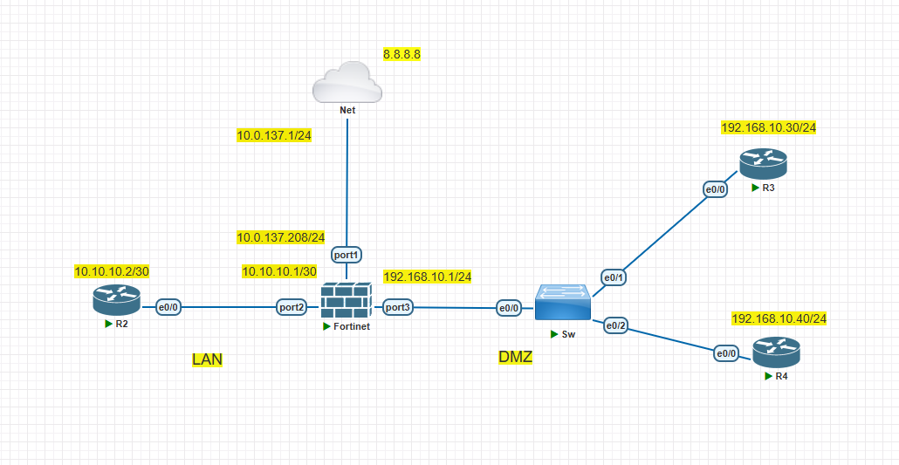

# Configure Basic

## Introduction

✍️ Kali ini kita konfigurasikan dasar dari Fortinet dengan menggunakan VMWare dan Install Pnetlab

## Prerequisite

✍️ Konfigurasi kali ini membutuhkan pengetahuan konfigurasi dasar jaringan

## Use Case

✍️ Digunakan saat pertama kali konfigurasi di perangkat Fortinet 

### Step 1 — Konfigurasi DHCP-Client dan Allowaccess
Konfigurasikan port1 (wan) bisa dengan static/dhcp disini saya menggunakan dhcp dan allow access untuk service yang ingin kita gunakan

  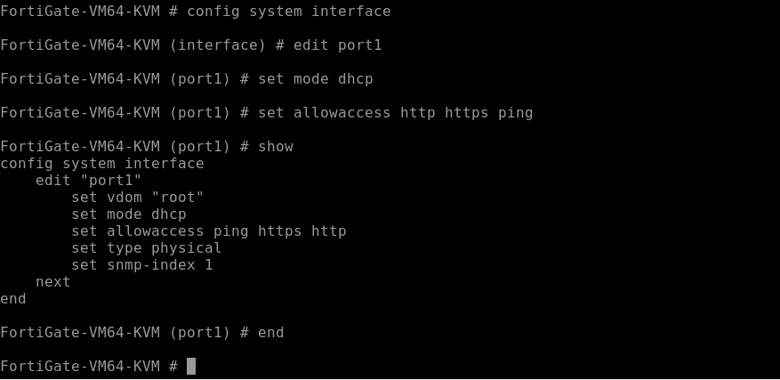

### Step 2 — Cek IP dari DHCP-Server
Karena saya menggunakan dhcp pastikan sudah mendapatkan ip dari dhcp-server 

  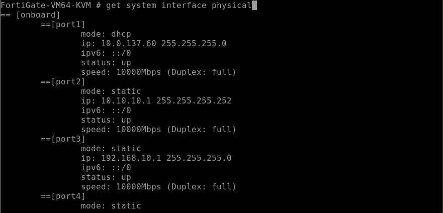

### Step 3 — Cek Dashboard Web Fortinet
Jika sudah mendapatkan ip dari dhcp-server mari coba kita akses di website dengan tampilan dashboard sebagai berikut

  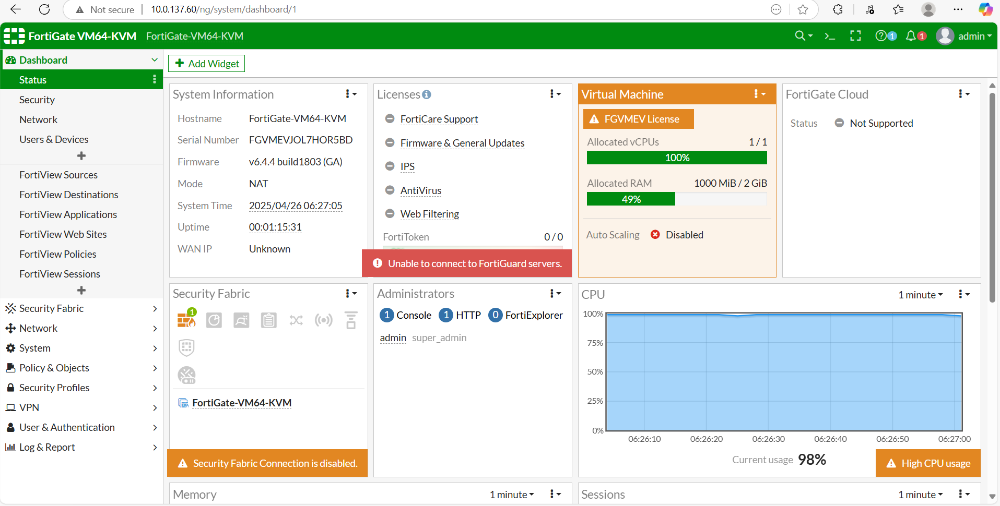

### Step 4 — Konfigurasi IP LAN dan DMZ
Untuk konfigurasi ip ke arah LAN dan DMZ kita konfigurasikan via GUI di web

  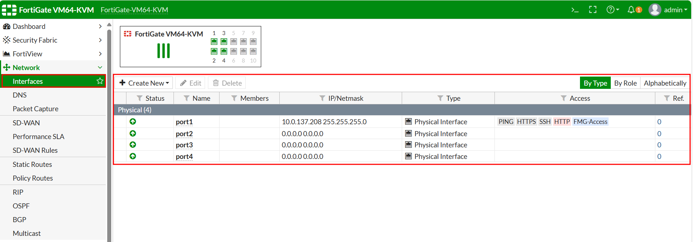

Dibawah ini untuk konfigurasi IP arah LAN

  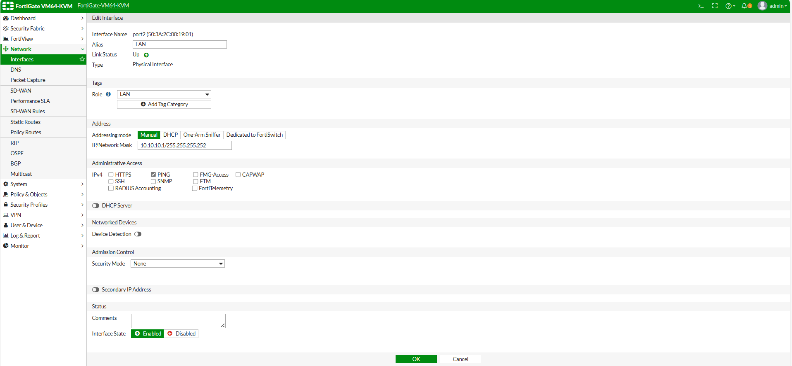

Dibawah ini untuk konfigurasi IP arah DMZ

  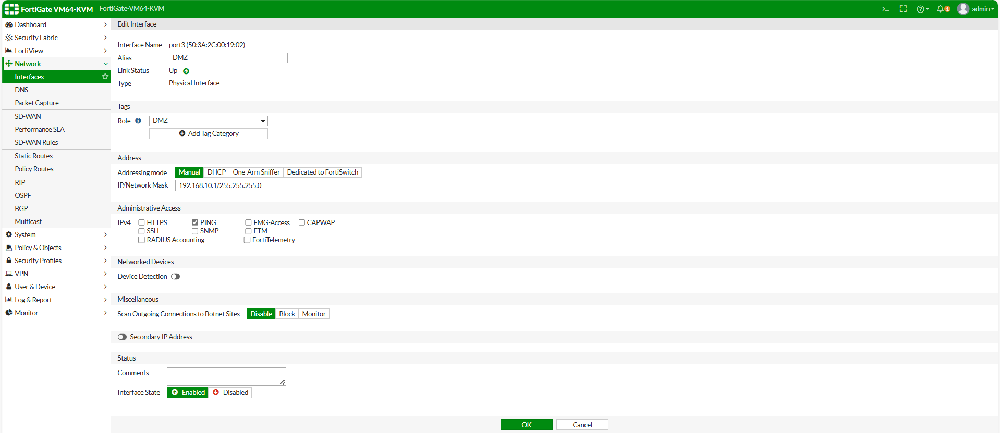

Berikut hasil dari IP LAN dan DMZ

  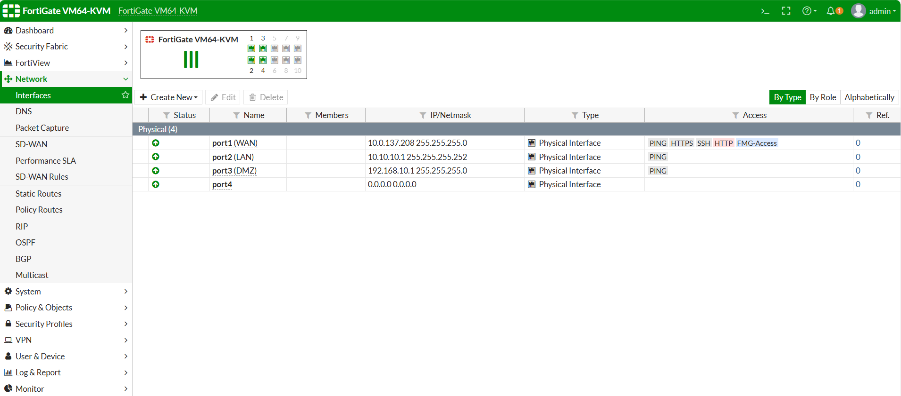

### Step 5 — Tes Konektifitas dari Fortinet ke LAN dan DMZ
Cek ping ke arah router di LAN dan DMZ

  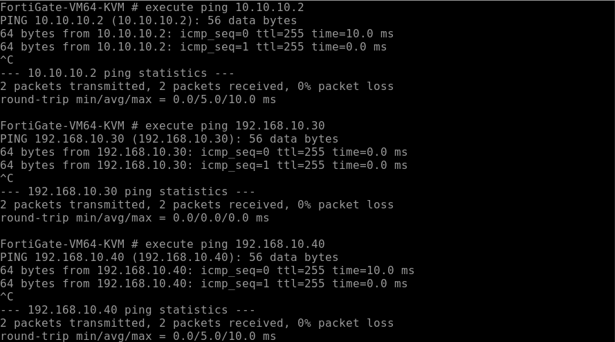

### Step 6 — Konfigurasi NAT di segmentasi LAN
Kita cek router di LAN belum bisa terhubung ke internet karena belum ada NAT

  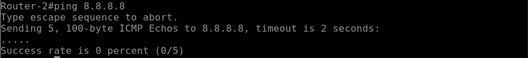

Konfigurasikan NAT pada Fortigate

  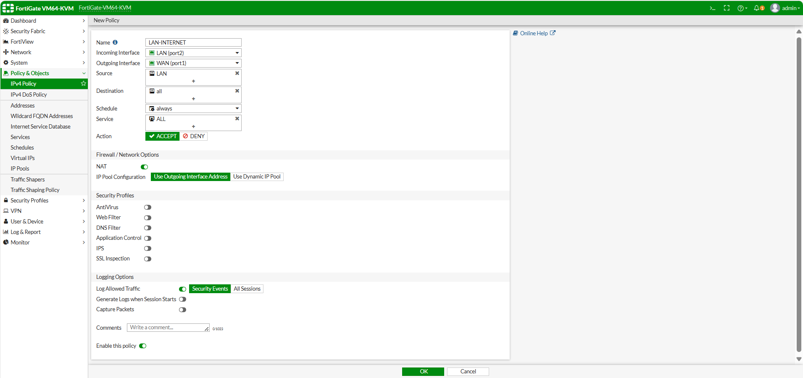

  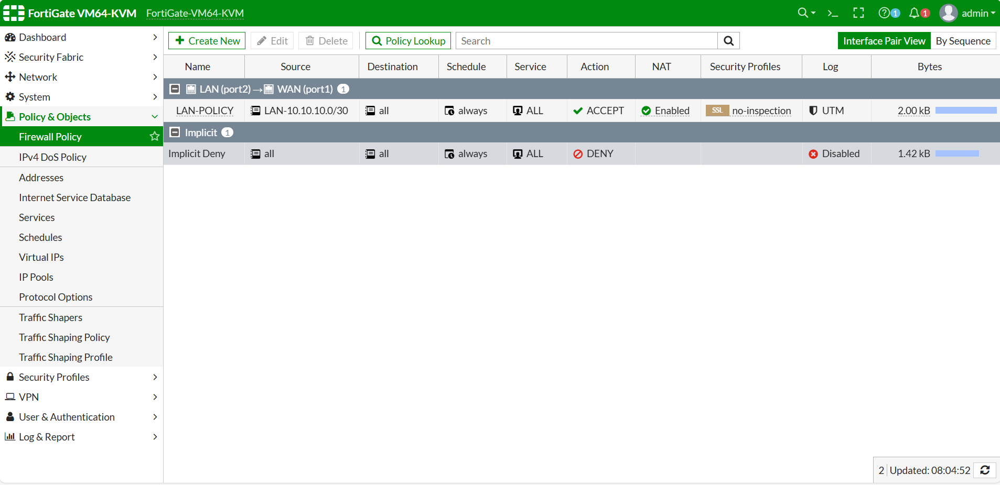

Cek lagi koneksi di Router-2 apakah sudah bisa terhubung ke internet ?

  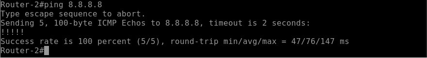

### Step 7 — Policy LAN ke DMZ
Cek dari segmentasi LAN apakah bisa terhubung ke segmentaasi DMZ ?

  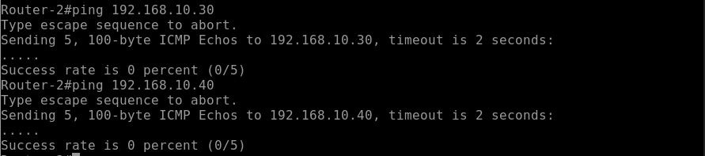

Belum bisa karena kita belum membuat rule untuk menerima paket dari LAN menuju DMZ harus kita buat di policy Fortigate

  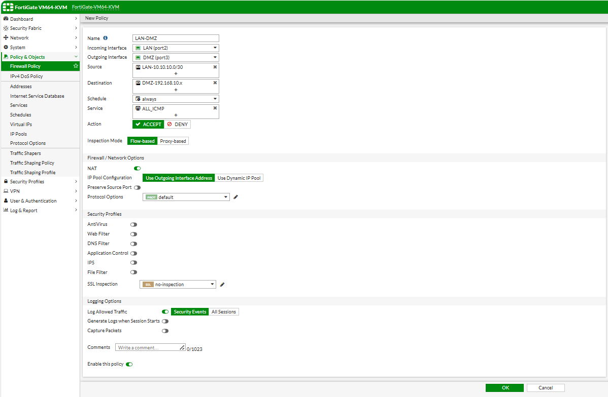

Kita cek lagi dari Router-2 menujue ke segmentasi DMZ

  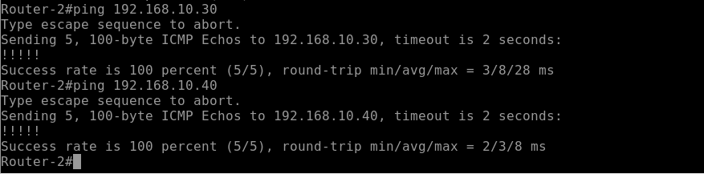

### Step 8 — Summary dari Policy NAT dan ACC LAN ke DMZ
Berikut hasil dari konfigurasi NAT dan Policy LAN ke DMZ

  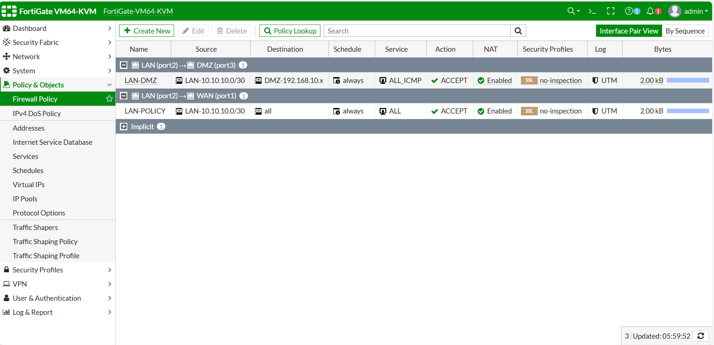

