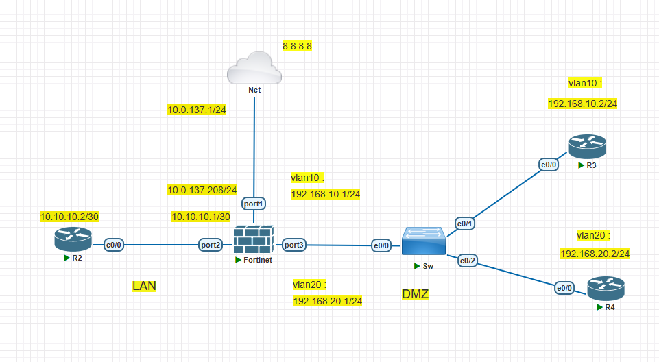
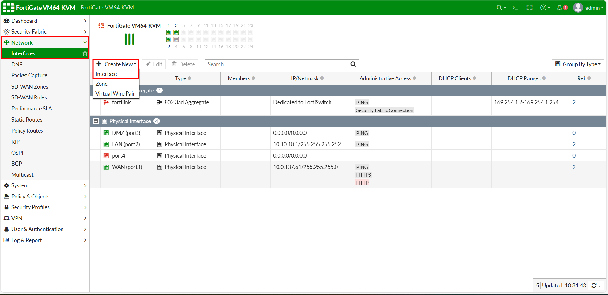
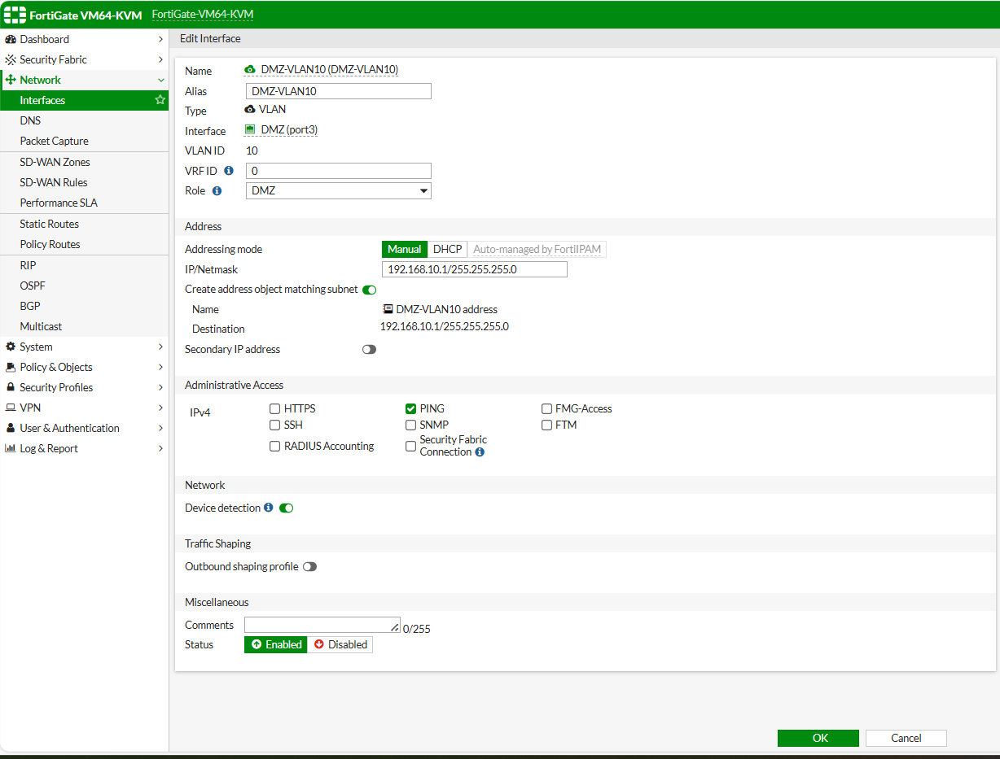
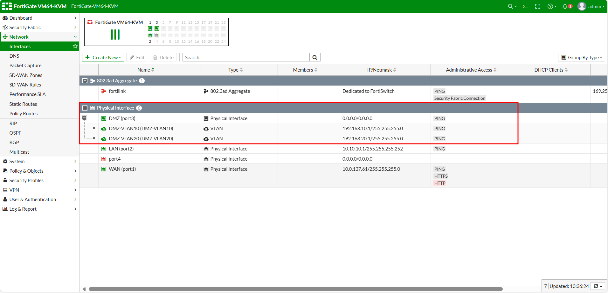
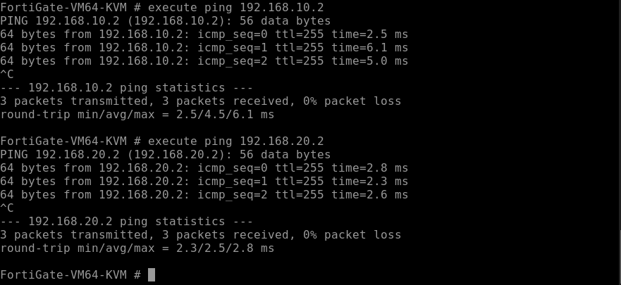
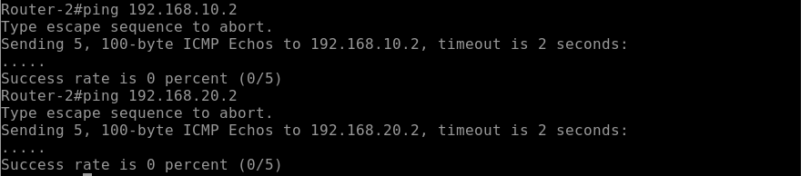
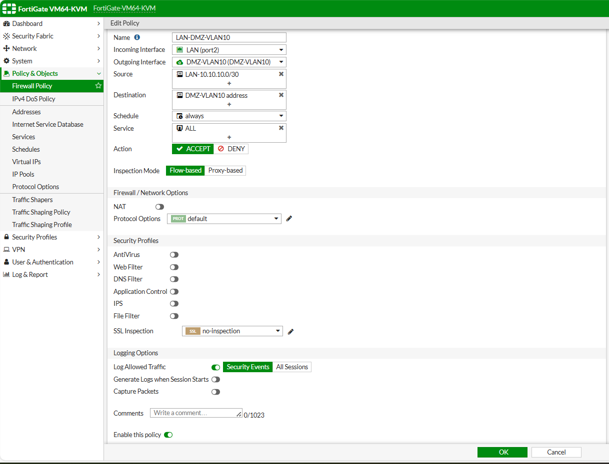
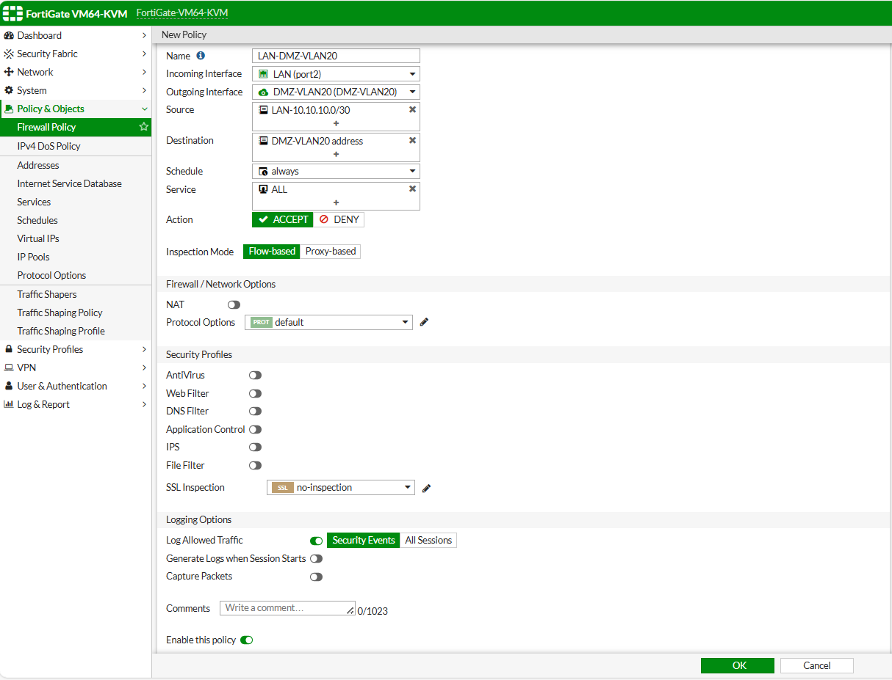
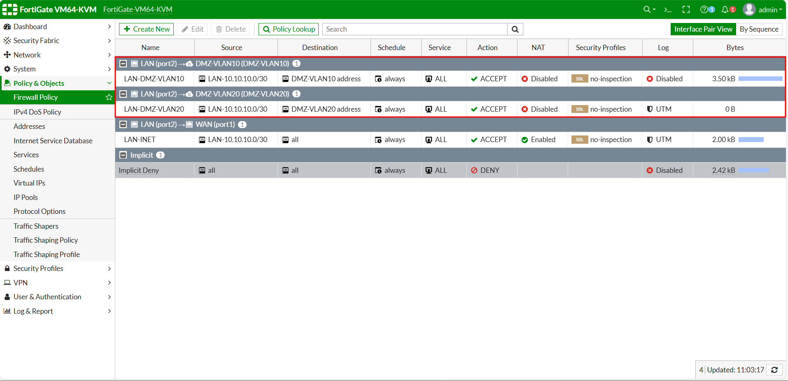
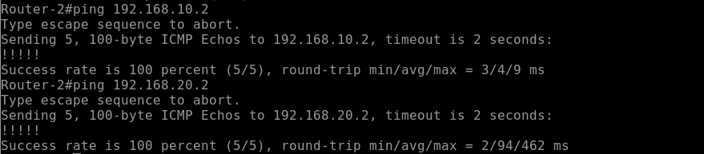

**Add a cover photo like:**
# Topologi

  

# Configure Sub Vlan Interface

## Introduction

✍️ Kali ini kita konfigurasikan Sub Vlan Interface untuk kebutuhan segmentasi network yang berbeda di DMZ

## Prerequisite

✍️ Konfigurasi kali ini membutuhkan pengetahuan konfigurasi dasar jaringan

## Use Case

✍️ Digunakan saat ingin memisahkan segmentasi menjadi 2 jaringan atau lebih

### Step 1 — Konfigurasi Vlan
Konfigurasikan new interface yag nantinya akan vlan akan tertambat di port 3

  

Buat vlan 10 dan vlan 20 dengan ip sesuai topologi untuk gateway

  

  

Berikut hasil hasil dari vlan 10 dan 20 di interface port 3

  

### Step 2 — Koneksi Fortigate ke Sub Vlan
Kita tes koneksi fortigate ke sub vlan di vlan 10 dan vlan 20

  

### Step 3 — Policy LAN ke DMZ
Kita tes koneksi dari Router-2 di segmentasi LAN menuju segmentasi DMZ dengan Sub Vlan

  

Karena belum ada policy untuk allow dari LAN ke DMZ kita perlu membuatnya di Policy Fortigate untuk mengarah ke vlan 10 dan vlan 20

  

  

Berikut hasil dari konfigurasi policy

  

Kita tes lagi koneksi dari segmentasi LAN ke DMZ dengan Sub Vlan

  

Bisa dilihat dari segmentasi LAN sudah bisa terhubung ke segmentasi DMZ dengan Sub Vlan
