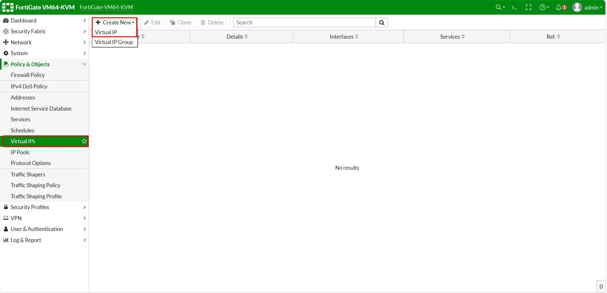

 **Add a cover photo like:**
# Topologi

  

# Configure DNAT Virtual IP

## Introduction

✍️ Kali ini kita konfigurasikan DNAT menggunakan Virtual IP pada Fortigate
## Prerequisite

✍️ Konfigurasi kali ini membutuhkan pengetahuan konfigurasi dasar jaringan

## Use Case

✍️ Digunakan jika ingin mengakses sistem kita dari luar jaringan (public)

### Step 1 — Buat Virtual IP
Konfigurasi Virtua IP di menu Virtual IP

  

Buat virtual ip untuk keperluan dnat ke arah 10.0.137.249 yang mengarah ke ip segmentasi vlan 10 DMZ

  

Buat virtual ip untuk keperluan dnat ke arah 10.0.137.249 yang mengarah ke ip segmentasi vlan 20 DMZ

  

Cek lagi konfigurasi Virtual IP

  

### Step 2 - Policy Untuk Akses dari Luar
Cek koneksi jika kita ping dari luar ke ip virtual sesuai topologi yang nanti kita buat masih belum ada jawaban response dari router tujuan

  

  

Buat policy baru di menu Firewall Policy

  

Policy untuk menerima akses dari WAN Public ke segmentasi vlan 10 DMZ

  

Policy untuk menerima akses dari WAN Public ke segmentasi vlan 20 DMZ

  

Cek ulang konfigurasi policy nya

  

### Step 3 — Cek Ulang Koneksi dari WAN
Bisa dilihat dibawah ketika mengontak ke IP yang telah kita set sudah ada jawaban atau mengarah ke ip tujuan sesuai dnat yang dibuat

  

  

