**Add a cover photo like:**
# Topologi

  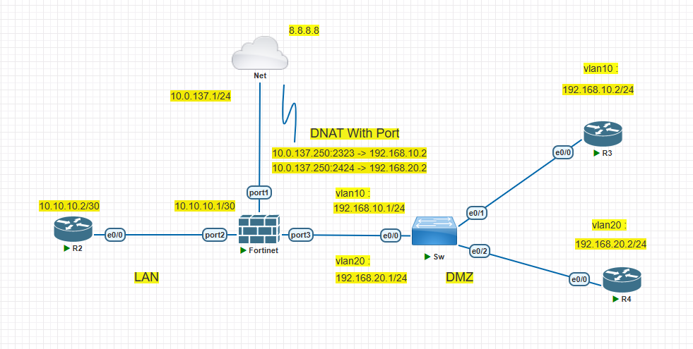

# Configure Port Forwarding DNAT

## Introduction

✍️ Kali ini kita konfigurasikan Port Forwarding pada Fortigate

## Prerequisite

✍️ Konfigurasi kali ini membutuhkan pengetahuan konfigurasi dasar jaringan

## Use Case

✍️ Digunakan jika ingin mengakses sistem kita dari luar menggunakan port tertentu

### Step 1 — Konfigurasi Virtual IP
Konfigurasi virtual ip di menu virtual ip

  

Buat port forwarding sesuai topologi dengan saat akses ip 10.0.137.250:2323 akan mengarah ke telnet 192.168.10.2:23

  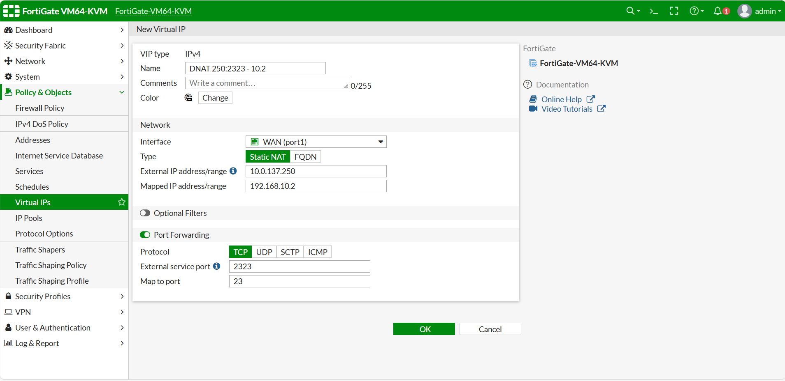

Buat port forwarding sesuai topologi dengan saat akses ip 10.0.137.250:2424 akan mengarah ke telnet 192.168.20.2:23

  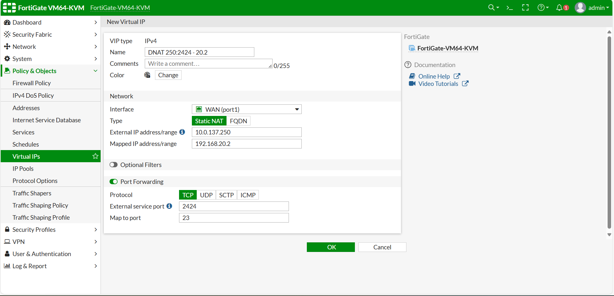

Cek ulang konfigurasi virtual ip

  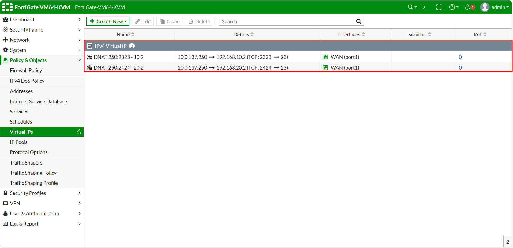

### Step 2 — Buat Policy dari Virtual IP
Cek koneksi dari WAN Public untuk akses ke ip dari yang kita konfigurasi sesuai topologi masih belum bisa

  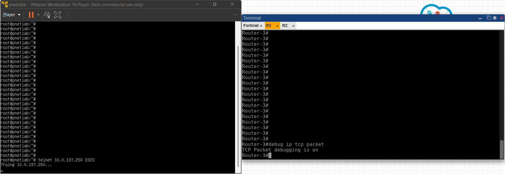

  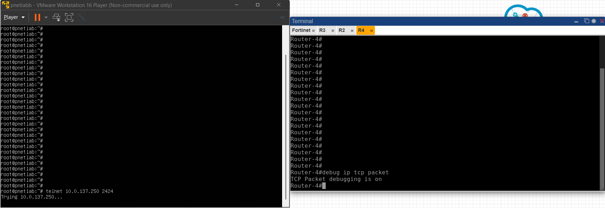

Buat Firewall Policy di menu Policy & Object

  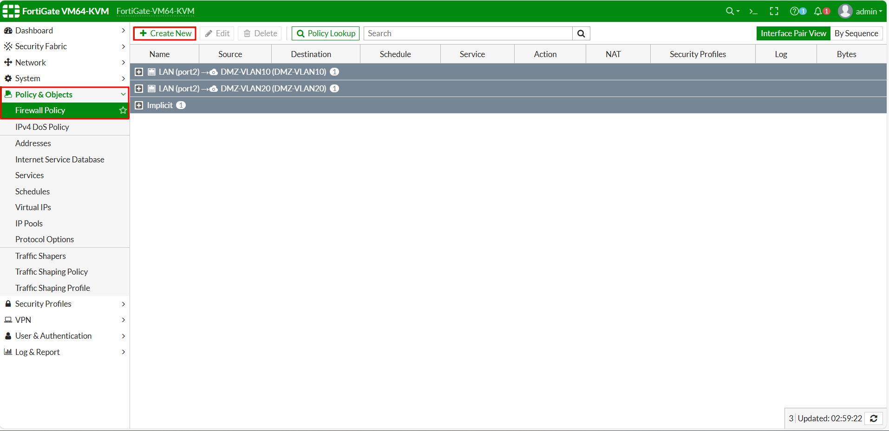

Buat policy untuk membuat akses dari WAN Public saat akses 10.0.137.250:2323 dan mengarah ke telnet 192.168.10.2:23

  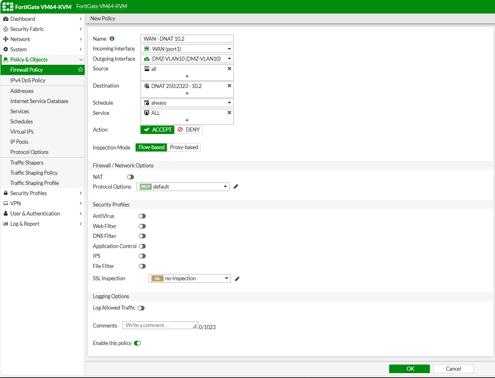

Buat policy untuk membuat akses dari WAN Public saat akses 10.0.137.250:2424 dan mengarah ke telnet 192.168.20.2:23

  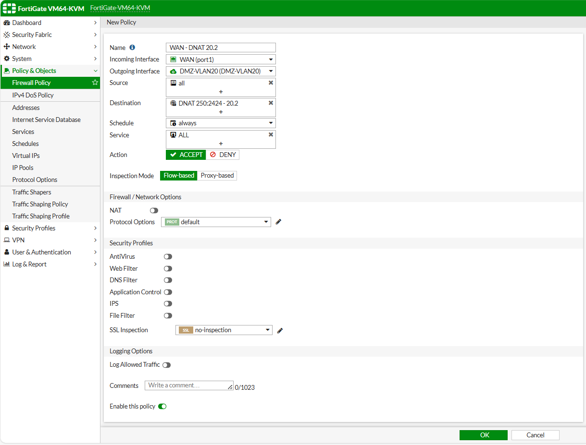

### Step 3 — Cek Koneksi Telnet dari Public
Bisa dilihat dibawah saat kita akses ip di fortigate dan dengan port forwarding kita otomatis mengakses ke ip sesuai tujuan

  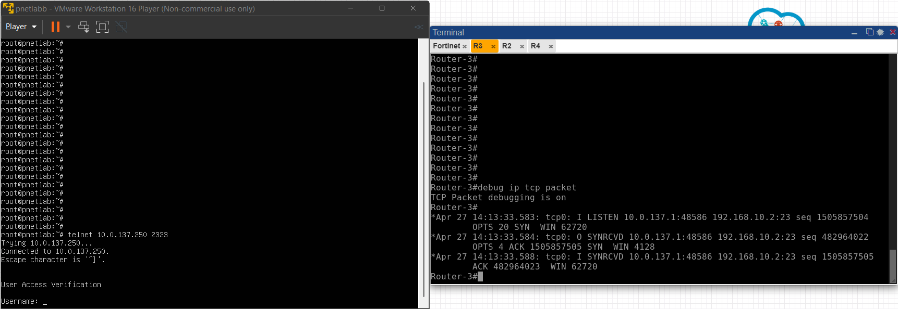

  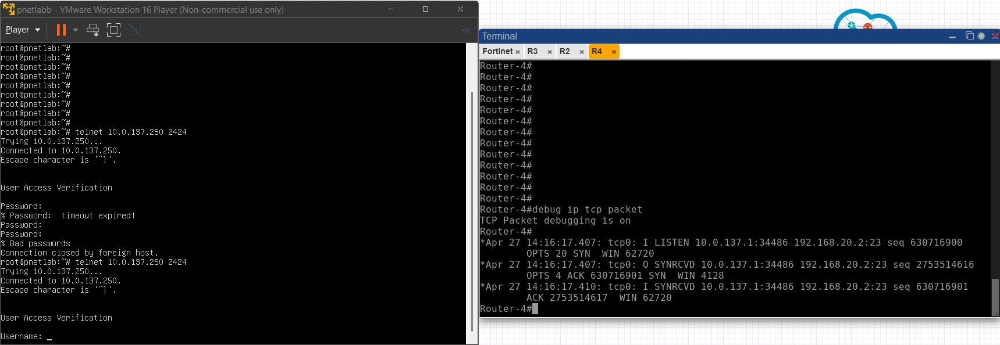

