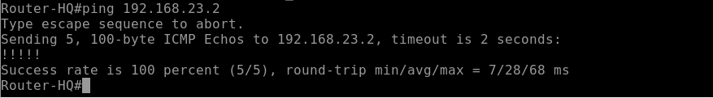

**Add a cover photo like:**
# Topologi

  

# Configure VPN IPSEC Fortigate

## Introduction

✍️ Kali ini kita konfigurasikan VPN IPsec antar Fortigate

## Prerequisite

✍️ Konfigurasi kali ini membutuhkan pengetahuan konfigurasi dasar jaringan

## Use Case

✍️ Digunakan jika ingin menghubungkan jaringan di 2 site berbeda dengan aman

### Step 1 — Konfigurasi Dasar
Konfigurasikan awal sesuai topologi untuk ip address di masing-masing interface di Fortiage HQ atau Branch

  

  

Tes Koneksi dari Router HQ dan Router Branch yang masih belum bisa terhubung

  

  

### Step 2 — Konfigurasi VPN IPsec pada Fortigate HQ Office
Buat VPN nya di menu VPN >> IPsec Wizard, pilih nama VPN dan perangkat VPN di sisi remote menggunakan apa kali ini kita menggunakan FortiGate jadi pilih Fortigate

  

Pilih Remote Address alamat IP Fortigate sisi lawan yang ingin dilakukan vpn dan tambahkan pre-shared key untuk keamanan

  

Selanjutnya pilih local-address dan remote address sebagai tujuan koneksi mana yang akan diizinkan di sisi local dan remote

  

Ini hasil review konfigurasi IPsec Wizard yang kita konfig pastikan benar parameter" yang digunakan

  

### Step 3 — Konfigurasi VPN IPsec pada Fortigate Branch Office
Buat VPN nya di menu VPN >> IPsec Wizard, pilih nama VPN dan perangkat VPN di sisi remote menggunakan apa kali ini kita menggunakan FortiGate jadi pilih Fortigate

  

Pilih Remote Address alamat IP Fortigate sisi lawan yang ingin dilakukan vpn dan tambahkan pre-shared key untuk keamanan

  

Selanjutnya pilih local-address dan remote address sebagai tujuan koneksi mana yang akan diizinkan di sisi local dan remote

  

Ini hasil review konfigurasi IPsec Wizard yang kita konfig pastikan benar parameter" yang digunakan

  

### Step 4 — Aktifkan VPN HQ-Office dan Branch-Office di HQ-Office
Untuk mengaktifkanya kita perlu membuat state up pada phase 2 sesuai tanda merah di menu IPsec Tunnel klik phase2

  

Pilih bring up pada phase 2 

  

Pastikan tanda up sudah beruhan dari tanda down sebelumnya

### Step 5 — Show Firewall Policy 
Kita cek firewall policy di HQ dan Branch

### Step 6 — Cek lagi koneksi Router HQ dan Router Branch 
Setelah di lakukan VPN untuk kedua site kita cek lagi koneksi vpn antar router hq dan branch

Bisa di lihat sudah terhubung koneksi antar office dengan menggunakan VPN IPsec dengan Fortigate

Dari hasil di atas juga sudah bit packet yang melewati jalur vpn saat kita coba lakukan tes koneksi ulang antar router office
