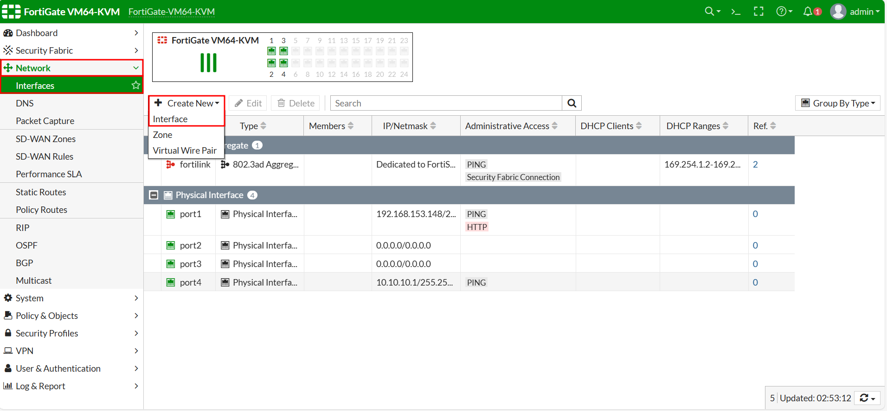

**Add a cover photo like:**
# Topologi

  

# Configure Link Aggregate

## Introduction

✍️ Kali ini kita konfigurasikan Link Aggregate LACP Fortigate dengan Switch Cisco

## Prerequisite

✍️ Konfigurasi kali ini membutuhkan pengetahuan konfigurasi dasar jaringan

## Use Case

✍️ Digunakan jika ingin membuat 2 port menjadi throughput yang lebih besar karena di gabung ataupun untuk fault tolerance

### Step 1 — Konfigurasi Pembuatan Interface Link Aggregate
Buat interface baru untuk link aggregate nya

  

  

Berikut hasil dari pembuatan interface link aggregate yang kita buat

  

### Step 2 — Konfigurasi Interface vlan DMZ
Buat interface vlan 10 dan vlan 20 untuk ke arah DMZ dengan ip interface masing-masing sesuai topologi dengan master interface nya link aggregate

  

  

Selanjutnya bisa di lihat status dari interface link aggregate masih dalam keadaan down

  

### Step 3 — Cek Koneksi Router vlan10 dan Router vlan20
Bisa dilihat masih rto ya untuk koneksi dari router vlan10 dan router vlan20 karena link aggregate belum up

  

  

### Step 4 — Konfigurasi Switch LACP dan Access
Konfigurasikan 2 interface menjadi 1 link aggregate dengan channel-group 1 pada switch cisco

  

Pada interface port-channel 1 perlu di konfigurasikan juga trunk ini lanjutan dari channel-group interface perlu kita buat

  

Cek show etherchannel pada switch cisco pastikan statusnya seperti gambar di bawah tidak Down

  

Pastikan juga konfigurasi interface ke arah router vlan10 dan vlan20 sudah kita buat mode akses

  

### Step 5 — Verifikasi Link Aggregate Pada Fortigate
Bisa dilihat setelah kita melakukan konfigurasi pada switch link aggregate yang tadinya warna merah (down) sekarang sudah up (hijau)

  

Tes lagi koneksi dari Router Vlan 10

  

Tes juga koneksi dari Router Vlan 20

### Step 6 — Konfigurasi Policy laptop ke DMZ
Bisa dilihat koneksi dari Laptop ke DMZ masih belum bisa walaupun link aggregate sudah UP

Buat policy untuk allow koneksi dari koneksi LAN arah Laptop ke DMZ 

Setelah rule policy allow di buat tes lagi apakah sudah bisa koneksi ke DMZ

