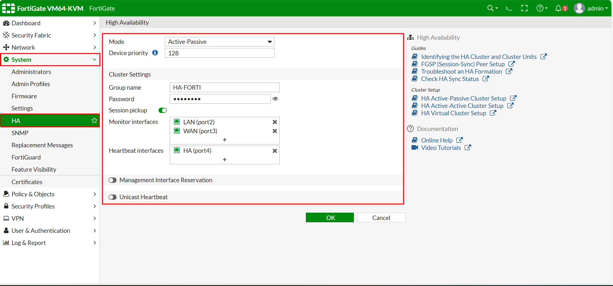

**Add a cover photo like:**
# Topologi

  

# Configure Link Aggregate

## Introduction

✍️ Kali ini kita konfigurasikan High Availability dengan system Active Passiv di Fortigate

## Prerequisite

✍️ Konfigurasi kali ini membutuhkan pengetahuan konfigurasi dasar jaringan

## Use Case

✍️ Digunakan jika ingin membuat high availability antisipasi downtime dengan fortigate

### Step 1 — Konfigurasi Dasar Interface dan IP Address
Konfigurasikan ip dan interface sesuai topologi seperti gambar di bawah pada fortigate

  

  

### Step 2 — Konfigurasi High Availability
Pada menu System >> HA buat HA baru 

  

Selanjutnya pada fortigate ke 2 sama konfigurasikan HA juga dengan nama grub dan password harus sama seperti fortigate 1

  

Setelah berhasil bisa di lihat status HA masih belum sync ya walaupun dari fortigate sudah menerima konfigurasi HA

  

Karena belum synchron kita bisa trigger pada fortigate-2 dengan perintah seperti berikut

  

Setelah di tunggu beberapa saat bisa di lihat berikut hasilnya jika antara 2 fortigate sudah sync

  

### Step 3 — Cek Koneksi Router-1 ke Router-2
Pastikan sebelum melakukan tes koneksi sudah membuat rule acc koneksi dari LAN(Router-1) ke WAN(Router-2) 

  

Selanjutnya aktifkan debug ip icmp untuk melihat paket yang keluar masuk pada Router-2

  

Pada Router-1 tes ping ke Router-2

  

Cek hasilnya pada Router-2 bisa di lihat berhasil sesuai status ping pada Router-1

  

### Step 4 — Pengetesan High Availability (HA)  
Saat kita mencoba melakukan ping sebelumnya berikut kondisi perangkat fortigate virtual saya jadi nyala semua 

  

Selanjutnya disini pada Router-1 saya mencoba repeat ping 100.000 ke Router-2 sambil mematikan Fortigate-1 yang menjadi jalur utama
Bisa dilihat hasilnya sempat ada timeout sebentar karena perpindahan dari fortigate-1 yang active karena mati jadi pindah ke fortigate-2 jadi active yang sebelumnya passive 

  

Bisa dilihat hostname yang aktif sekarang hanya fortigate-2 karena saya masih mematikan fortigate-1

  

Berikut ini kondisi akhir setelah saya menyalakan kembali fortigate-1 nya

  

