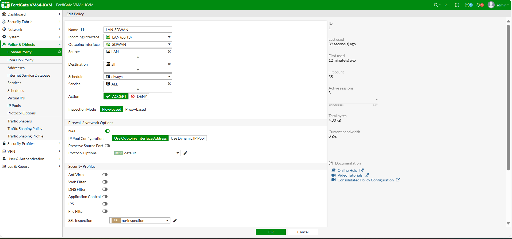

**Add a cover photo like:**
# Topologi

  

# Configure SD-Wan Dasar

## Introduction

✍️ Kali ini kita konfigurasikan SD-Wan Dasar pada Fortigate

## Prerequisite

✍️ Konfigurasi kali ini membutuhkan pengetahuan konfigurasi dasar jaringan

## Use Case

✍️ Digunakan jika ingin membuat 2 ISP baik saling backup atau mencari best quality content dari salah satu isp dan fungsi lainya lagi

### Step 1 — Konfigurasi Interface dan IP
Konfigurasikan Interface dan IP Sesuai topologi

  

### Step 2 — Konfigurasi SD-Wan Zone
Buat SD-Wan baru pada menu SD-Wan Zones

  

Cukup berikan nama pada SD-WAN nya

  

Berikut hasilnya

  

### Step 3 — Konfigurasi SD-Wan Member
Setelah membuat SD-Wan Zone buat SD-Wan Membernya masih pada menu yang sama

  

Tambahkan ISP-1 dan ISP-2 beserta gateway nya 

  

  

Berikut hasilnya dari penambahan member SD-Wan Member

  

### Step 4 — Konfigurasi SD-Wan Rules
Buat baru SD-Wan Rules untuk keperluan kita mengatur SLA dari internet yang kita gunakan

  

Isikan parameter yang di perlukan seperti source-address, destination, pilih strategi yang digunakan juga pada pilihan yang disediakan disini saya memilih load balance. Pada "Required SLA Target" kita perliu membuat SLA Target baru 

  

Berikut SLA Target yang saya tetapkan untuk lab ini ke dns google

  

Tambahkan pada Required SLA Target

  

Setelah selesai berikut hasilnya

  

### Step 5 — Verifikasi Performance SLA
Bisa dilihat pada menu Performance SLA bisa dilihat bagaimana hasilnya, disini karena virtual dan melewati hotspot jadi seperti yang bisa di lihat sangat tinggi ya latency ping jitter ke dns google haha

  

### Step 6 — Cek Load Balance 
Pastikan sudah membuat rule acc dari LAN ke SDWAN

Buat juga def-route ke arah SD-WAN

Kita lihat dulu traffic awal yang sudah lewat pada SD-WAN Zones seperti berikut ya nilainya

  

Selanjutnya tes kita ping apakah kedua isp berjalan ? jika berjalan kedua traffic akan bertambah ya

  

Lihat hasilnya ya kedua traffic ISP sama-sama bertambah karena sesuai tujuan kita melakukan load balance

  

Setelah rule policy allow di buat tes lagi apakah sudah bisa koneksi ke DMZ

